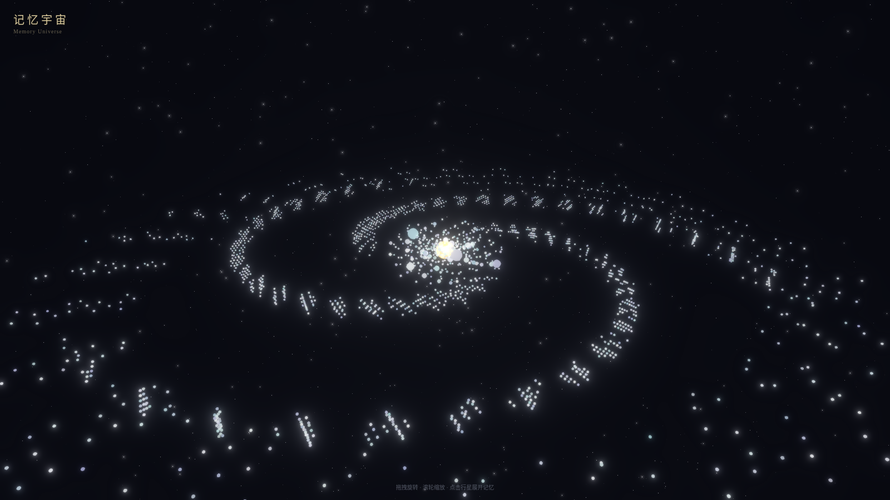

# 记忆宇宙 · Memory Universe

把 AI 记忆库可视化成一座**可交互的三维星系**。

每一段记忆是一颗星，每一个语义锚点是一颗行星，深空里的星云是记忆的密度分布。用真实恒星数据（HYG v4.4）铺底，让你能"飞进去"看见自己的记忆长什么样。

> 一个为 AI Agent 长期记忆系统做的可视化前端。数据源是 [agent-memory-bridge](https://github.com/dust-11/agent-memory-bridge) 生成的 `memory.db`。



## 功能

- **三维记忆星图** — 记忆/锚点按语义聚类分布在三维空间，可旋转、缩放、穿行
- **锚点行星** — 每个语义锚点是一颗行星，行星大小与关联记忆数量相关
- **记忆云** — 归属于锚点的记忆以粒子云形式围绕行星聚集
- **星云体积** — 用体积渲染表现记忆密度的"氛围"，而不是硬画点
- **侧边详情面板** — 点选恒星/行星查看对应记忆的摘要与类型
- **真实星空背景** — 底层使用 HYG v4.4 真实恒星目录，不是随机撒点

## 技术栈

| 层 | 用了什么 |
|---|---|
| 渲染 | React 19 + Three.js + [@react-three/fiber](https://github.com/pmndrs/react-three-fiber) |
| 效果 | [@react-three/drei](https://github.com/pmndrs/drei) + [@react-three/postprocessing](https://github.com/pmndrs/postprocessing) |
| 状态 | [zustand](https://github.com/pmndrs/zustand) |
| 构建 | Vite + TypeScript |
| 数据 | Node HTTP server + `better-sqlite3` 只读读取 `memory.db` |

## 快速开始

```bash
# 1. 安装依赖（已全部声明在 package.json）
npm install

# 2. 指向你的记忆库（默认 ~/.openclaw/memory/memory.db）
export MEMORY_DB=/path/to/your/memory.db

# 3. 启动数据服务（端口 3001，Vite 会代理到它）
node server.mjs

# 4. 另开一个终端，启动前端
npm run dev
```

构建生产版本：

```bash
npm run build      # 产物在 dist/
npm run preview    # 本地预览构建产物
```

## 环境要求

- **Node.js 18+**
- 一个 **`memory.db`**（由 [agent-memory-bridge](https://github.com/dust-11/agent-memory-bridge) 生成）
- 通过 `MEMORY_DB` 环境变量指定数据库路径；未设置时默认读 `~/.openclaw/memory/memory.db`

`server.mjs` 以**只读**方式打开数据库，不会修改你的记忆库。

## 依赖

运行时依赖（见 `package.json`）：

| 包 | 用途 | 许可 |
|---|---|---|
| [react](https://github.com/facebook/react) / [react-dom](https://github.com/facebook/react) | UI 框架 | MIT |
| [three](https://github.com/mrdoob/three.js) | 3D 渲染引擎 | MIT |
| [@react-three/fiber](https://github.com/pmndrs/react-three-fiber) | Three.js 的 React 绑定 | MIT |
| [@react-three/drei](https://github.com/pmndrs/drei) | r3f 常用组件与助手 | MIT |
| [@react-three/postprocessing](https://github.com/pmndrs/postprocessing) | 后处理特效（辉光等） | MIT |
| [zustand](https://github.com/pmndrs/zustand) | 轻量状态管理 | MIT |
| [better-sqlite3](https://github.com/WiseLibs/better-sqlite3) | 同步 SQLite 驱动（`server.mjs`） | MIT |

开发依赖：Vite、TypeScript、oxlint、@vitejs/plugin-react、@types/* — 均为 MIT。

## 不含什么 / 需要你自己准备

- **`memory.db` 本体不在本仓库** — 这是个人的记忆数据，不随代码分发。请用 [agent-memory-bridge](https://github.com/dust-11/agent-memory-bridge) 建立你自己的库。
- **不含任何 API 密钥或个人数据** — 仓库里只有代码、演示截图和公开的天文星表。
- 仓库里的 `data/live_preview*.png` 是演示用截图，不是真实数据导出。

## 数据来源与致谢

- [**HYG Database v4.4**](https://github.com/astronexus/HYG-Database)（David Nash）— 真实恒星目录，用于背景星空的底图数据。请以该项目自身声明的许可为准。
- [**Three.js**](https://github.com/mrdoob/three.js)、[**React Three Fiber**](https://github.com/pmndrs/react-three-fiber) 及其生态（drei / postprocessing / zustand）— 让浏览器里的三维渲染变得可行。
- [**React**](https://github.com/facebook/react) 与 [**Vite**](https://github.com/vitejs/vite) — 前端框架与构建工具。

以上均以 npm 依赖方式引入，本仓库未内联任何第三方源码，各自仍遵循其原许可。

## 许可

本仓库目前**尚未指定开源许可**（无 `LICENSE` 文件），默认保留所有权利。若要让他人自由使用/修改/分发，建议补一个许可证（MIT 或 Apache-2.0 都是常见选择）。
